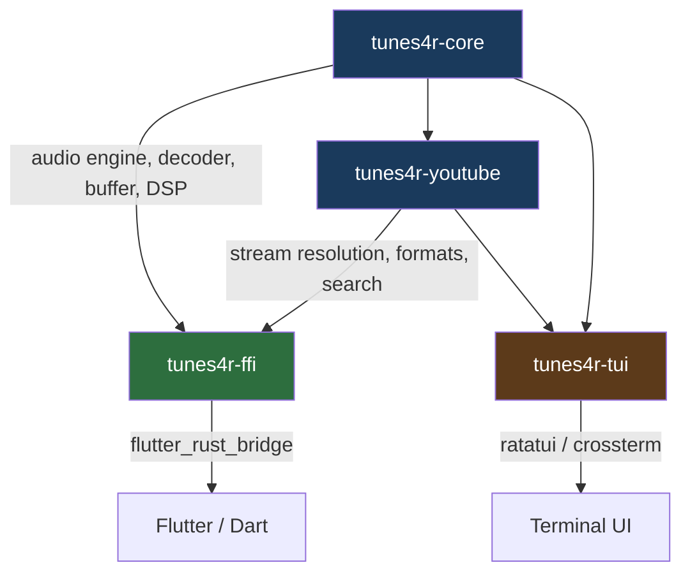

# tunes4r — Architecture & Bug Assessment

## Executive Summary

This document is a prioritised assessment for an AI agent (or human) to use as
a work-order. It is structured as **bugs first, then architecture improvements**,
because the seek regressions are the most urgent user-facing problems.

---

## Part 1 — Bug Fixes (Priority Order)

### BUG-1 · YouTube seek opens a new HTTP connection from byte 0 every time  *(Critical)*

**Files:** `src/audio/engine/commands.rs` → `seek()` `PlaybackType::Stream` branch,
`src/audio/stream/source/youtube.rs` → `open()`

**Root cause:**  
When seeking a YouTube stream the engine calls `source.open(None)` — passing
`None` regardless of the target position — then relies on
`fast_forward_stream_seek` to decode-and-discard frames until it reaches the
target. This means:

1. A new TCP connection is always made from byte 0 of the CDN URL.
2. Thousands of frames are decoded (CPU waste) and thrown away.
3. For a seek near the end of a long video this can take 10–30 seconds.
4. The CDN URL has a limited lifetime; by the time the seek completes on a slow
   link the URL may have expired, causing a 403.

**What should happen instead:**  
YouTube CDN URLs (`googlevideo.com`) support byte-range requests.
The correct strategy depends on direction:

| Direction | Correct approach |
|-----------|-----------------|
| **Backward** | Re-open with `Range: bytes=<estimated_offset>-` using the already-resolved CDN URL stored in `YouTubeSource.audio_url` |
| **Forward (within buffered window)** | Fast-forward through the in-memory decode queue — no new HTTP connection |
| **Forward (outside buffered window)** | Re-open with `Range: bytes=<estimated_offset>-` |

**Fix instructions:**

In `YouTubeSource::open(seek_to: Option<u64>)`, the byte-offset estimation logic
already exists (`estimate_byte_offset`) but it is only called when
`total_content_bytes > 0`. The problem is that `total_content_bytes` is only
stored *after* the first successful `open(None)` call returns, so it is always 0
at seek time (a new `source.open(None)` is being opened before the counter has
been populated).

Fix in two steps:

1. **Store `content_length` eagerly** — after the first `open(None)` response,
   call `self.total_content_bytes.store(cl, Relaxed)` inside `YouTubeSource`
   and also persist it in the engine as `pipe_total_bytes` (this already exists
   in `play_pipeline` but is never re-applied on seek).

2. **In `seek()` for `PlaybackType::Stream`**, instead of calling
   `source.open(None)`, call `source.open(Some(position_ms))`. `YouTubeSource`
   will then compute the byte offset and send `Range: bytes=<offset>-`. Remove
   the subsequent `fast_forward_stream_seek` call for this path.

3. **Guard `fast_forward_stream_seek`** — keep it only for seekable sources that
   do NOT support byte-range (e.g. a plain HTTP file without `Accept-Ranges`).

---

### BUG-2 · Live radio backward seek is broken — byte-offset formula is inverted  *(Critical)*

**Files:** `src/audio/stream/handling.rs` → `play_live_internal()`,
`src/audio/stream/source/live.rs` → `open()`

**Root cause:**  
In `play_live_internal` the seek offset is computed as:

```rust
let byte_offset = (seek_pos as f64 * bytes_per_ms) as u64;
let clamped = if total > byte_offset { total - byte_offset } else { 0 };
```

`seek_pos` here is an *absolute* millisecond position from the start of the
stream (e.g. 900_000 for 15 min into a 30-min buffer). `bytes_per_ms` is
`total_written / cache_max_ms` — also from the start. The formula therefore
gives the byte position *from the beginning of the ring buffer*, which is
correct. **But then it is subtracted from `total`** — inverting it to point
near the *end* of the buffer. A seek to 15 min ends up playing content from
minute 29.

The same inversion exists in `LiveSource::open()`:

```rust
let byte_offset = (ms as f64 * bytes_per_ms) as u64;
...
total_written.saturating_sub(byte_offset)   // ← wrong direction
```

`total_written.saturating_sub(byte_offset)` gives the byte position of content
that was written `byte_offset` bytes *ago* — i.e. content from the past relative
to `total_written`. This is correct for "seek backward by N ms" semantics, but
`ms` here is an absolute position (not a delta), so the result is wrong.

**Fix:**  
The seek parameter passed from the engine (`seek_target_ms`) is always an
**absolute position in ms from time=0** of the playback session. The ring buffer
tracks `total_written` bytes and has a capacity of `cache_max_ms` milliseconds.

The correct formula:

```rust
// How many ms ago was the target, relative to the live edge?
let ms_from_live_edge = cache_max_ms.saturating_sub(seek_pos_ms);
let byte_offset_from_live_edge = (ms_from_live_edge as f64 * bytes_per_ms) as u64;
// Absolute byte address in the ring is total_written minus that offset
let abs_offset = total_written.saturating_sub(byte_offset_from_live_edge);
```

This fix must be applied consistently in **both**:
- `play_live_internal()` in `handling.rs`
- `LiveSource::open()` in `source/live.rs`

Also: the engine currently passes `seek_target_ms` as a wall-clock position
relative to playback start, but `play_live_internal` treats it as ms-from-live-edge.
Pick one convention and document it with a `/// INVARIANT:` comment.

---

### BUG-3 · Live radio `canSeek` is always `false` in the Flutter UI  *(High)*

**Files:** `src/audio/stream/source/live.rs`, Flutter `main.dart`

`LiveSource::supports(Capability::Seek)` returns `true`, but the engine's
`source_supports()` method checks `self.source` which is only populated by
`play_pipeline`. When `play_live` is called it goes through a *separate code
path* (`PlaybackType::Live` in `commands.rs`) that does **not** set
`self.source`. As a result the Flutter side sees `canSeek = false` and
disables the seek slider.

**Fix:**  
In the `play_live` command path, after constructing a `LiveSource`, assign it
to `self.source = Some(Box::new(live_source))` before spawning the decode
thread. Ensure the live ring (`self.live_ring`) is populated from the same
source instance.

---

### BUG-4 · YouTube seek issues a new resolution (YT API) call on every seek  *(High)*

**Files:** `src/audio/stream/handling.rs` → `play_adaptive_buffer_internal()`

The `play_adaptive_buffer_internal` function (used by the legacy `PlaybackType::AdaptiveBuffer`
path, still reachable via `play_stream`) re-resolves the YouTube video manifest
on every seek because it receives a YouTube watch URL rather than the already
resolved CDN URL. For a single seek this adds 500–2000 ms of latency and hits
the YouTube API.

**Fix:**  
The newer `play_pipeline` path already caches the resolved CDN URL in
`YouTubeSource.audio_url`. The `AdaptiveBuffer` playback type should be
**retired** and callers migrated to `play_pipeline`. All remaining references
to `play_adaptive_buffer_internal` in `commands.rs` should be replaced with
the `PlaybackType::Stream` path.

---

### BUG-5 · `fast_forward_stream_seek` creates a second decoder instance  *(Medium)*

**Files:** `src/audio/stream/handling.rs`

`fast_forward_stream_seek` builds its own `CodecRegistry` and decoder to
fast-forward. Then `decode_and_play_from_read` builds *another* decoder for
the actual playback. The skipped frames in the first decoder are not fed into
the second one, so any stateful codec (AAC, Vorbis, Opus) will have bad state
at the seek point, causing audio glitches for the first few seconds after seek.

**Fix:**  
Fast-forward by discarding packets at the *format reader* level (call
`format.next_packet()` and drop without decoding) up to the target timestamp.
Then decode the first real packet to warm up the single decoder that will be
used for playback. This is both faster and codec-state-safe.

---

### BUG-6 · Flutter `_liveSection` — forward seek is not prevented  *(Medium)*

**Files:** Flutter `main.dart`

The Flutter `_bufferedSlider` widget allows the user to drag the thumb past the
`_buffer.writeOffsetMs`, which for a live source represents the live edge.
Seeking *forward* past the live edge is meaningless and currently causes the
engine to try to seek beyond `total_written`, landing at the live edge (confusing
but not crashing).

**Fix in `main.dart`:**  
In `_bufferedSlider`, when `_activeSource == _SourceType.live`, clamp the drag
value to `_buffer.writeOffsetMs.toDouble()` instead of `total`:

```dart
final maxSeek = source == _SourceType.live
    ? _buffer.writeOffsetMs.toDouble()
    : total;
setState(() => _dragValue = raw.clamp(0.0, maxSeek));
```

Also remove the `Resume` button from the live section's `_transportRow` — live
streams do not pause/resume; they seek to live edge on resume.

---

### BUG-7 · Duplicate log line in `decode_and_play_from_read`  *(Low)*

**Files:** `src/audio/stream/handling.rs` line ~224

```rust
info!("[stream] Connected! Detecting format...");
info!("[stream] Connected! Detecting format...");  // ← exact duplicate
```

Remove the second line.

---

## Part 2 — Architecture Improvements

> These are improvements, not blockers. Address after the bugs above are fixed.

### ARCH-1 · Split into workspace crates  *(Recommended)*

The single crate does too many things. A natural split:

```
tunes4r/
├── Cargo.toml              (workspace)
├── tunes4r-core/           # Audio engine, decoder, buffer — no FFI, no UI
├── tunes4r-youtube/        # YouTube extraction — depends on core
├── tunes4r-ffi/            # flutter_rust_bridge bindings — depends on core + youtube
└── tunes4r-tui/            # TUI example — depends on core + youtube (dev)
```

Benefits:
- `tunes4r-core` can be tested independently with `cargo test` (no FFI noise).
- `tunes4r-youtube` can be updated / feature-flagged without touching audio code.
- Compile times improve because only changed crates rebuild.

This is **not** a quick change — it requires adjusting import paths across ~50
files — but the code is already modularly organised so the logical boundaries
are clear.

---

### ARCH-2 · Remove `play_adaptive_buffer_internal` / `play_stream_internal` dead paths  *(Recommended)*

`handling.rs` contains `play_stream_internal` and `play_adaptive_buffer_internal`
which duplicate logic that already exists in the `play_pipeline` path. Both
functions are ~200 lines each, contain their own YouTube resolution logic (BUG-4),
and are only kept for Android compatibility.

**Action:** Unify on `play_pipeline` + `decode_and_play_from_read` for all
platforms. Android-specific differences (async HTTP via Tokio) should be
isolated to `src/audio/stream/source/youtube.rs` and `radio.rs` behind
`#[cfg(target_os = "android")]` blocks on the `open()` method, not in separate
top-level functions.

---

### ARCH-3 · Seek convention: abolish `seek_target_ms` atomic shared state  *(Recommended)*

Currently the seek target is passed as `Arc<AtomicU64>` into decode threads.
The thread polls this value inside `decode_and_play_from_read`. This creates
a subtle race: if the user seeks twice quickly, the second value overwrites the
first before the decode thread reads it.

**Better pattern:** Pass seek as a one-shot channel message `mpsc::Sender<SeekCommand>`.
The decode thread selects on new packets vs. seek messages. This is idiomatic
Rust, eliminates the race, and removes the `seek_target_ms.store(0, Relaxed)`
reset pattern scattered across the codebase (DRY violation).

---

### ARCH-4 · `decode_and_play_from_read` is too large — extract phases  *(Recommended)*

The function is ~400 lines, mixes format probing, device initialisation,
pre-buffering, playback loop, and drain. Apply SRP:

```rust
fn probe_format(reader) -> Result<ProbedFormat, _>
fn init_output_device(sample_rate, channels) -> Result<(Device, StreamConfig), _>
fn prebuffer(format, decoder, queue, target_samples) -> Result<usize, _>
fn playback_loop(format, decoder, queue, should_stop, ...)
```

Each phase is independently testable, and errors are easier to attribute.

---

### ARCH-5 · DRY: HTTP headers repeated in 5 places  *(Low)*

The YouTube User-Agent + Referer + Origin header block is copied verbatim in:
- `source/youtube.rs` (non-Android path)
- `source/youtube.rs` (Android path)
- `stream/handling.rs` `play_stream_internal` YouTube branch
- `stream/handling.rs` `play_adaptive_buffer_internal`
- `stream/handling.rs` `play_live_internal`

Extract to a shared `fn youtube_headers() -> reqwest::header::HeaderMap` in
`src/audio/http.rs` and call it from all sites.

---

### ARCH-6 · Flutter: extract seek slider to its own widget  *(Low)*

`_bufferedSlider` is defined inline in the app state class and referenced three
times via `_SourceType` enum comparisons. Extract to a stateless
`BufferedSlider` widget that takes `position`, `total`, `buffer`, `canSeek`,
and `isLive` as constructor parameters. This eliminates the `_activeSource`
coupling (DRY + SRP).

---

## Part 3 — Crate Split Diagram



---

## Part 4 — File Change Summary (for agent)

| File | Change type | Bugs fixed |
|------|-------------|------------|
| `src/audio/engine/commands.rs` | Modify `seek()` | BUG-1, BUG-3, BUG-4 |
| `src/audio/stream/source/youtube.rs` | Modify `open()`, store content-length eagerly | BUG-1 |
| `src/audio/stream/handling.rs` | Fix byte-offset formula in `play_live_internal`, remove dup log | BUG-2, BUG-7 |
| `src/audio/stream/source/live.rs` | Fix byte-offset formula in `open()` | BUG-2 |
| `src/audio/stream/source/live.rs` + `commands.rs` | Set `self.source` in live path | BUG-3 |
| `src/audio/stream/handling.rs` | Replace dual-decoder fast-forward | BUG-5 |
| `flutter/lib/main.dart` | Clamp live seek, remove Resume button | BUG-6 |
| `src/audio/http.rs` | Add `youtube_headers()` helper | ARCH-5 |
| `src/audio/stream/handling.rs` | Extract phases from `decode_and_play_from_read` | ARCH-4 |

**Files NOT touched by bugs (architecture only, can defer):**  
`Cargo.toml`, all `src/youtube/` files, `src/classifier.rs`, `src/ffi.rs`.

---

## Part 5 — Notes on SOLID / DRY / KISS

| Principle | Current violation | Fix reference |
|-----------|------------------|---------------|
| **SRP** | `decode_and_play_from_read` handles probe + device + decode + drain | ARCH-4 |
| **SRP** | `handling.rs` owns both HTTP fetch and audio decode | ARCH-2 |
| **OCP** | Adding a new source type requires editing `commands.rs` `seek()` match | ARCH-3 (channel-based seek removes the need for this match entirely) |
| **DRY** | YouTube HTTP headers × 5 | ARCH-5 |
| **DRY** | YouTube manifest resolution duplicated in `source/youtube.rs` + `handling.rs` | ARCH-2 |
| **DRY** | Thread-spawn boilerplate (clone 10+ Arcs) repeated for every seek branch | ARCH-3 |
| **KISS** | `seek_target_ms` atomic shared across threads is error-prone | ARCH-3 |
| **KISS** | `PlaybackType` enum forces every seek handler to pattern-match all variants | ARCH-3 |