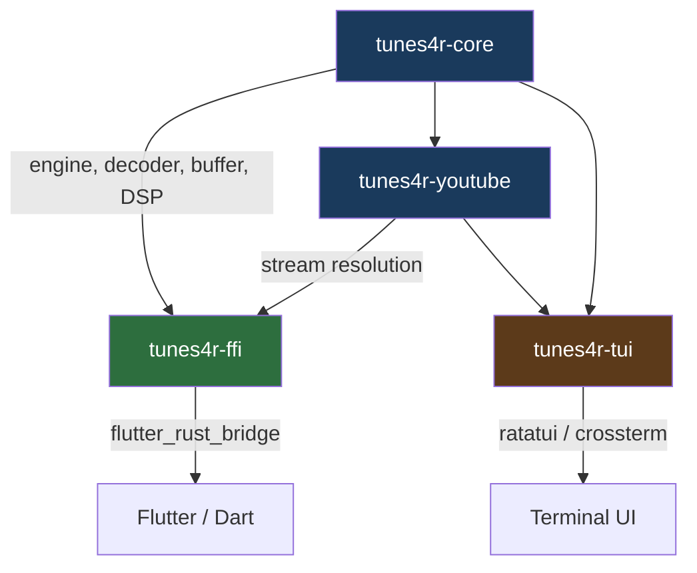

# tunes4r — Architecture & Bug Assessment (v2)

> Updated after review of platform consolidation feasibility and
> BUG-1 / MISSING-1 / live seek direction discussions.

---

## Part 1 — Bug Fixes (Priority Order)

### BUG-1 · YouTube seek re-downloads from byte 0 on every seek  *(Critical)*

**Files:** `src/audio/engine/commands.rs` → `seek()` `PlaybackType::Stream` branch,
`src/audio/stream/source/youtube.rs` → `open()`

**Root cause:**  
`seek()` calls `source.open(None)` — always byte 0 — then uses
`fast_forward_stream_seek` to decode-and-discard frames until reaching the
target.  For a 10-minute video, seeking to minute 8 means downloading ~80% of
the file before a sample is heard.

**Chosen fix — Option 2 (HTTP Range + exact header cache):**  
Option 1 (Symphonia native seek) was considered but rejected: `reqwest::Response`
does not implement `std::io::Seek`, so Symphonia falls back to sequential
read/decode-and-discard anyway, making it equivalent to the current broken
behavior.

The correct approach:

```
Initial open(None):
  → HTTP GET bytes=0-
  → Tee bytes through a HeaderCacheWriter: Vec<u8>
  → Stop caching once Symphonia signals probe complete
    (track exact bytes consumed, NOT a fixed 64KB)
  → Store header_cache: Vec<u8> in YouTubeSource

Seek to position_ms:
  → byte_offset = estimate_byte_offset(position_ms, content_length)
  → HTTP GET Range: bytes=<byte_offset>-
  → ChainReader = Cursor<header_cache> + range_response_body
  → Symphonia re-probes from cache (no network), then decodes from offset
  → Remove fast_forward_stream_seek entirely for this path
```

**Critical detail — do NOT hardcode 64KB.**  
The header cache must capture exactly the bytes Symphonia consumed during
initial probing.  For M4A this is the `moov` atom (variable, can exceed 200KB
for long videos).  Use a `TeeReader` wrapper and record the byte count at
probe completion.  The `Cursor<Vec<u8>>` implements both `Read` and `Seek`,
so Symphonia's re-probe within the header region works without network access.

**Direction guard for live radio (see BUG-2):**  
Forward seeks past the buffered window on live sources must still be blocked
(clamped to `writeOffsetMs` in the Flutter slider — see BUG-6).

---

### BUG-2 · Live radio backward seek — byte-offset formula is inverted  *(Critical)*

**Files:** `src/audio/stream/handling.rs` → `play_live_internal()`,
`src/audio/stream/source/live.rs` → `open()`

**Root cause:**  
`seek_target_ms` is an **absolute position from playback start** (e.g. 900_000
for 15 min).  Both `play_live_internal` and `LiveSource::open()` treat it as
a delta and subtract it from `total_written`, inverting the direction.
A seek to 15 min plays content from minute 29 on a 30-min buffer.

**Fix — consistent formula in both locations:**

```rust
// ms_ago = how far back from the live edge the target is
let ms_ago = cache_max_ms.saturating_sub(seek_pos_ms);
let bytes_per_ms = total_written as f64 / cache_max_ms as f64;
let byte_offset_from_live_edge = (ms_ago as f64 * bytes_per_ms) as u64;
let abs_offset = total_written.saturating_sub(byte_offset_from_live_edge);
```

Add a `/// INVARIANT: seek_target_ms is absolute ms from playback start, not a
delta from the live edge` comment at both call sites to prevent regression.

---

### BUG-3 · Live radio `canSeek` always `false` in Flutter UI  *(High)*

**Files:** `src/audio/engine/commands.rs` → `play_live()`, `src/audio/stream/source/live.rs`

**Root cause:**  
`engine.source_supports(Capability::Seek)` reads `self.source`, which is only
set by `play_pipeline`.  The `play_live` command path uses `PlaybackType::Live`
directly and never sets `self.source`.

**Fix:** In the `play_live` command, after constructing `LiveSource`, assign:
```rust
self.source = Some(Box::new(live_source.clone()));
```
before spawning the decode thread.

---

### BUG-4 · YouTube seek re-resolves the manifest on every seek  *(High)*

**Files:** `src/audio/stream/handling.rs` → `play_adaptive_buffer_internal()`

The legacy `AdaptiveBuffer` path re-resolves the YouTube manifest on every
seek (500–2000ms latency, hits the YT API).  This path should be **retired**.
All callers in `commands.rs` must be migrated to `play_pipeline` / `PlaybackType::Stream`
which already caches the resolved CDN URL in `YouTubeSource.audio_url`.

---

### BUG-5 · `fast_forward_stream_seek` uses a second decoder — codec state corruption  *(Medium)*

**Files:** `src/audio/stream/handling.rs`

Two decoder instances are created: one for fast-forward, one for playback.
Stateful codecs (AAC, Vorbis, Opus) produce glitched audio for several seconds
after seek.

**Fix:** Discard packets at the format-reader level (call `format.next_packet()`
and drop without decoding) until reaching the target timestamp.  Decode the
first real packet with the single playback decoder to warm up its state.
This function becomes dead code once BUG-1 is fixed with Option 2 — remove it.

---

### BUG-6 · Flutter live seek slider allows forward seeks past the live edge  *(Medium)*

**File:** Flutter `main.dart`

The drag clamp in `_bufferedSlider` uses `total` for all source types.  For
live, forward seeking past `writeOffsetMs` is meaningless.

**Fix:**
```dart
final maxSeek = source == _SourceType.live
    ? _buffer.writeOffsetMs.toDouble()
    : total;
setState(() => _dragValue = raw.clamp(0.0, maxSeek));
```
Also remove the `Resume` button from the live `_transportRow`.
Live streams do not pause; resume should seek to the live edge.

---

### MISSING-1 · No buffer poller for live streams — UI indicator stays at 0  *(Deferred)*

**Decision: Skip for now.**

The proposed poller using `total_written` would display values past
`cache_max_ms` because `total_written` is monotonically increasing and never
resets.  The correct display formula is:

```rust
write_offset_ms = min(elapsed_since_stream_start_ms, cache_max_ms)
```

Implement this **after BUG-2 is fixed and verified**, using a
`start_time: Instant` stored in `LiveSource` at `start_download()`.
The seek slider range can use `cache_max_ms` directly in the interim.

---

### BUG-7 · Duplicate log line  *(Low)*

**File:** `src/audio/stream/handling.rs` ~line 224

```rust
info!("[stream] Connected! Detecting format...");
info!("[stream] Connected! Detecting format...");  // remove this line
```

---

## Part 2 — Platform Consolidation  *(New section)*

### Current state: three decoder files, ~2,600 lines, substantial duplication

| Function | `file_decoder.rs` | `ios_file_decoder.rs` | `android_file_decoder.rs` |
|---|---|---|---|
| `play_file_internal` | ✅ 389 lines (canonical) | ⚠️ 300 lines (reads whole file into Vec) | ⚠️ 395 lines + JVM attach |
| `play_stream_internal` | ✅ in `handling.rs` | ⚠️ 256 lines (buffers full response) | ⚠️ 94 lines (async Tokio pipe) |
| `play_stream_from_pipe_internal` | ✅ delegates to `decode_and_play_from_read` | ✅ delegates | ✅ delegates |
| `play_adaptive_buffer_internal` | ⚠️ in `handling.rs` (retire) | ⚠️ 270 lines (has disk cache) | ⚠️ 90 lines stub |
| `decode_and_play_from_read` | ✅ in `handling.rs` (shared) | ✅ calls shared | ✅ calls shared |

**What is genuinely platform-specific (keep in platform modules):**

| Concern | Android | iOS | Desktop |
|---|---|---|---|
| JVM thread attach | ✅ Required | ❌ | ❌ |
| `android_logger` init | ✅ Required | ❌ | ❌ |
| Async HTTP (Tokio) | ✅ Required (`reqwest::Client` is async-only) | ❌ | ❌ |
| Disk response cache | ❌ | ✅ iOS `play_adaptive_buffer_internal` only | ❌ |
| Full-body buffering for streams | ❌ | ✅ (current, but wrong — see below) | ❌ |

**iOS `play_stream_internal` buffers the entire response into `Vec<u8>` before
decoding.** This is not an iOS requirement — it is a workaround for the absence
of streaming HTTP.  It should be replaced with the pipe-based approach already
used by `play_stream_from_pipe_internal`.

---

### ARCH-PLAT · Consolidation plan

**Goal:** reduce to one shared decode path + thin platform shims.

```
src/audio/
├── decoder/
│   ├── mod.rs               (routes to platform shim)
│   ├── seek.rs              (✅ already shared — keep)
│   ├── file_decoder.rs      (✅ canonical — keep, minor cleanup)
│   ├── platform/
│   │   ├── android.rs       (JVM attach + Tokio HTTP fetch only)
│   │   └── ios.rs           (empty or thin shim — remove disk cache)
│   └── (remove ios_file_decoder.rs and android_file_decoder.rs)
└── stream/
    └── handling.rs          (decode_and_play_from_read — all platforms)
```

**The platform shim contract** is a single trait:

```rust
/// Platform-specific HTTP fetch that pushes bytes into a PipeWriter.
/// Android uses async Tokio; desktop/iOS use blocking reqwest.
pub trait HttpFetcher: Send + 'static {
    fn fetch(url: &str, range_start: u64, writer: Arc<PipeWriter>);
}
```

Both paths (blocking and async Tokio) already produce the same `PipeReader`
output that `decode_and_play_from_read` consumes.  The consolidation is:

1. Extract Android's Tokio fetch loop into `platform/android.rs` as
   `struct AndroidFetcher` implementing `HttpFetcher`.
2. Extract desktop/iOS blocking fetch into `platform/desktop.rs` as
   `struct BlockingFetcher`.
3. `play_stream_internal` becomes a single function in `handling.rs` that
   accepts `impl HttpFetcher` — no `#[cfg]` gates.
4. Delete `ios_file_decoder.rs` — iOS `play_file_internal` is identical to
   `file_decoder.rs` except it reads the whole file into `Vec<u8>` first
   (which `file_decoder.rs` also does — they are the same code).
5. Delete `android_file_decoder.rs::play_file_internal` — the decode loop is
   identical to `file_decoder.rs`; only the JVM attach and logger init at the
   top are Android-specific.  Add a `platform_init()` call at the top of the
   unified function, implemented as a no-op on non-Android.

**What remains platform-gated after consolidation:**

```rust
// src/audio/platform.rs — the ONLY file with #[cfg(target_os)]
#[cfg(target_os = "android")]
pub fn platform_init() {
    android_logger::init_once(...);
    attach_current_thread_to_jvm();
}

#[cfg(not(target_os = "android"))]
pub fn platform_init() {}

#[cfg(target_os = "android")]
pub type Fetcher = AndroidFetcher;   // async Tokio

#[cfg(not(target_os = "android"))]
pub type Fetcher = BlockingFetcher;  // blocking reqwest
```

This reduces `#[cfg(target_os)]` gates from **~70 across 9 files** to **~6 in
1 file**.

---

## Part 3 — Architecture Improvements

### ARCH-1 · Workspace crate split  *(Recommended — after bugs fixed)*



Natural boundaries already exist in the module tree.  Compile-time benefit is
significant because `tunes4r-youtube` (rquickjs, heavy) only rebuilds when
YouTube extraction changes.

---

### ARCH-2 · Retire `play_adaptive_buffer_internal` / `play_stream_internal`  *(Recommended)*

These functions (~500 lines total) duplicate logic already in `play_pipeline` +
`decode_and_play_from_read`.  They are the primary source of the BUG-4 manifest
re-resolution.  Remove after migration to `play_pipeline`.

---

### ARCH-3 · Replace `seek_target_ms` AtomicU64 with a channel  *(Recommended)*

The shared `Arc<AtomicU64>` for seek creates a race when the user seeks twice
quickly (second write overwrites before the thread reads).  Replace with
`mpsc::Sender<SeekCommand>` polled inside the decode loop.  This also removes
the `seek_target_ms.store(0, Relaxed)` reset pattern scattered across the
codebase (DRY violation, 9 occurrences).

---

### ARCH-4 · Split `decode_and_play_from_read` into phases  *(Recommended)*

At ~400 lines it violates SRP.  Extract:

```rust
fn probe_format(reader) -> Result<ProbedFormat>
fn init_output_device(sample_rate, channels) -> Result<(Device, Config)>
fn prebuffer(format, decoder, queue, target) -> Result<usize>
fn playback_loop(format, decoder, queue, stop_signal, ...)
```

Each phase is independently testable.

---

### ARCH-5 · DRY: YouTube HTTP headers  *(Low)*

The User-Agent + Referer + Origin block is copied in 5 places.
Extract to `fn youtube_request_headers() -> HeaderMap` in `src/audio/http.rs`.

---

### ARCH-6 · Flutter: extract `BufferedSlider` widget  *(Low)*

`_bufferedSlider` is defined inline and selected via `_SourceType` enum
comparison.  Extract to a stateless `BufferedSlider` widget with explicit
`isLive` parameter.  Removes `_activeSource` coupling (SRP + DRY).

---

## Part 4 — SOLID / DRY / KISS Scorecard

| Principle | Current violation | Fix reference |
|-----------|------------------|---------------|
| **SRP** | `decode_and_play_from_read` — probe + device + decode + drain | ARCH-4 |
| **SRP** | `handling.rs` owns both HTTP fetch logic and audio decode | ARCH-PLAT |
| **SRP** | `android_file_decoder.rs` — 1,318 lines, 5 unrelated functions | ARCH-PLAT |
| **OCP** | `seek()` must be edited for every new `PlaybackType` variant | ARCH-3 |
| **DRY** | `play_file_internal` exists in 3 files, ~identical | ARCH-PLAT |
| **DRY** | `play_stream_internal` exists in 3 files with different HTTP strategies | ARCH-PLAT |
| **DRY** | YouTube manifest resolution in 3 separate locations | ARCH-2 |
| **DRY** | YouTube HTTP headers × 5 | ARCH-5 |
| **DRY** | `seek_target_ms.store(0, Relaxed)` reset × 9 | ARCH-3 |
| **DRY** | `#[cfg(target_os)]` gates in 9 files | ARCH-PLAT |
| **KISS** | `seek_target_ms` AtomicU64 shared across threads — silent race | ARCH-3 |
| **KISS** | iOS streams buffer entire response before decode (wrong approach) | ARCH-PLAT |

---

## Part 5 — File Change Summary (for agent)

### Bug fixes (do first)

| File | Change | Bugs fixed |
|------|--------|------------|
| `src/audio/stream/source/youtube.rs` | Add `TeeReader` header cache; use Range header on `open(Some(ms))` | BUG-1 |
| `src/audio/engine/commands.rs` | Call `source.open(Some(position_ms))` in seek; remove fast-forward for YT; set `self.source` in live path | BUG-1, BUG-3, BUG-4 |
| `src/audio/stream/handling.rs` | Fix live byte-offset formula; remove duplicate log; remove `fast_forward_stream_seek` | BUG-2, BUG-5, BUG-7 |
| `src/audio/stream/source/live.rs` | Fix byte-offset formula; store `start_time: Instant` | BUG-2, MISSING-1 prep |
| `flutter/lib/main.dart` | Clamp live seek to `writeOffsetMs`; remove Resume from live section | BUG-6 |

### Platform consolidation (do second)

| Action | Files affected |
|--------|----------------|
| Create `src/audio/platform.rs` with `platform_init()` + `Fetcher` type alias | New file |
| Create `src/audio/decoder/platform/android.rs` — `AndroidFetcher` only | New file |
| Create `src/audio/decoder/platform/desktop.rs` — `BlockingFetcher` | New file |
| Unify `play_file_internal` → `file_decoder.rs` canonical | Remove iOS/Android duplicates |
| Unify `play_stream_internal` → single function in `handling.rs` via `HttpFetcher` trait | Remove from iOS/Android decoders |
| Delete `ios_file_decoder.rs` | Delete |
| Gut `android_file_decoder.rs` to only `platform_init()` + `AndroidFetcher` | Heavily modify |
| Update `decoder/mod.rs` routing | Modify |

### Architecture (do last, after above is stable)

| Action | Files |
|--------|-------|
| Workspace split | `Cargo.toml` + all import paths |
| `decode_and_play_from_read` phase extraction | `handling.rs` |
| `seek_target_ms` → channel | `commands.rs`, `handling.rs`, `file_decoder.rs` |
| `youtube_request_headers()` helper | `http.rs` + 5 callers |